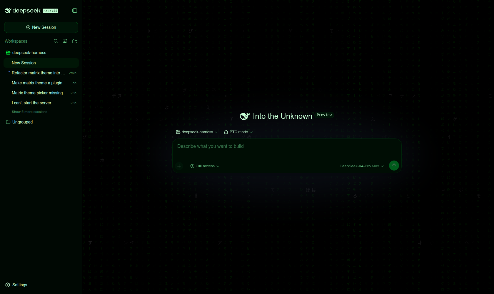

# dsh-matrix-theme

The Matrix movie theme for the [dsh](https://github.com/deepseek-ai/deepseek-harness) web GUI as an installable plugin: the selectable `matrix` theme (green-on-black palette over the dark base), a digital-rain ambient backdrop (a faithful port of the [zengrz.github.io](https://github.com/zengrz/zengrz.github.io) glyph wall), its General-settings toggle row, and a rain-quality row that trades backdrop effects for performance on slower machines. One package carries both roles: the `dsh.bundle` patch layer (`cordis.patch.yml` inserts the `ui-matrix-theme` browser roster row) and the `dsh.client` plugin itself (`lib/client.js`, prebuilt and committed — no build step runs at install time).



## Install

```sh
dsh plugin --profile <name> add github:zengrz/dsh-matrix-theme
```

Pin a commit so a later push cannot silently change what runs:

```sh
dsh plugin --profile <name> add github:zengrz/dsh-matrix-theme#<sha>
```

No build permission (`allowBuilds`) is needed: the published entry points are committed, and the package has no `prepare` script.

## Requirements and compatibility

- On a harness that declares the `shell.backdrop` slot (ui-layout from the dsh release that introduced the ambient backdrop slot), the rain renders inside the frame's backdrop layer — below every column, click-through, and managed by the slot system.
- On a harness that **predates** the `shell.backdrop` slot (e.g. dsh `0.1.0-rc.8`), the plugin detects the missing slot at boot and falls back to a fixed-position DOM canvas behind the app root, driving the same `RainEngine`. The palette and the General-settings toggle work identically on both paths; only the backdrop's mount site differs. The fallback retires itself if the slot is later declared (e.g. a harness upgrade mid-session via HMR).
- The patch **appends and does not dedupe**: adding this plugin to a profile whose layers already register `ui-matrix-theme` — the stock `dsh-web-app` bundle ships the theme in-box from the same release — fails the load with `duplicate loader entry id: ui-matrix-theme`. Such profiles already have the theme; this plugin targets custom browser-surface rosters and web-app versions that predate the theme.
- The browser half resolves its platform peers (`react`, the `@deepseek-ai/dsh-client-*` module table) from the host profile's own client stack; this repository bundles only the theme's own code.

## Rain quality

The General section gains a **Rain effects** row (below the Matrix theme row, visible while the matrix theme is active) with three levels:

- **Full** — the faithful reference effect: full-density glyph wall, per-glyph churn, cursor spotlight, and the 3D tilt.
- **Lite** — for older or integrated-GPU machines: the column/row grid draws at half density (a quarter of the per-frame glyph draws), glyph churn and the cursor spotlight are dropped, and columns faded to near-invisible depth are culled entirely. The cheap signature effects (the 3D tilt and the marching white cell) stay.
- **Off** — no canvas at all: the green palette stays, the rain costs nothing (same skip as `prefers-reduced-motion: reduce`).

The level is a plugin-owned browser preference persisted to `localStorage` under `dsh-matrix-theme:rain-quality`; storage failures only disable persistence. Changing the level while the rain runs replaces the engine (the grid rebuilds at the new density).

## Model Experience

None: the theme manages browser-side preferences (theme selection and rain quality) and the backdrop is decorative (`aria-hidden`); nothing reaches a model request.

## Rebuilding the artifacts

`lib/` is committed. To regenerate it after editing `src/`, build inside a [deepseek-harness](https://github.com/deepseek-ai/deepseek-harness) checkout (the client bundle's loader-handoff id must match this package name). Create a machine-local `build.tsdown.config.ts` (gitignored):

```ts
import { clientBundle } from '<harness>/packages/client/tsdown.client.ts'
export default clientBundle('dsh-matrix-theme', ['src/index.ts'])
```

then run:

```sh
cd <this-repo>
ln -sfn <harness>/packages/client/ui-matrix-theme/node_modules node_modules
<harness>/node_modules/.bin/tsdown --config build.tsdown.config.ts
```

## License

[MIT](LICENSE), matching the dsh family. The theme engine is a port of the MIT-licensed [zengrz.github.io](https://github.com/zengrz/zengrz.github.io) effect.
